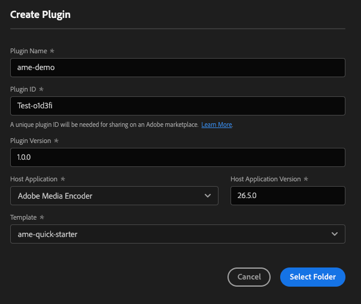
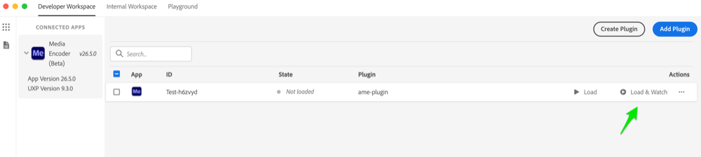
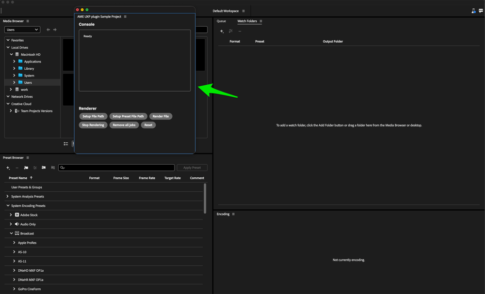
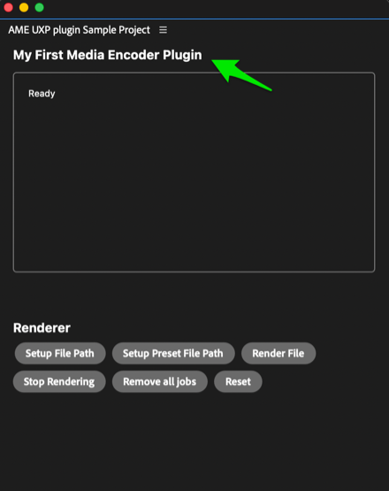

# Build Your First Plugin

By the end of this tutorial you'll have a working UXP plugin running inside Adobe Media Encoder: a panel you scaffolded from a template, edited in your code editor, and watched reload live in the host app. It's the shortest path from an empty folder to something on screen.

You won't write much code here. The goal is to learn the loop you'll use for every plugin: scaffold, load, edit, reload.

## Prerequisites

- Adobe Media Encoder 26.5 or newer, installed and running.
- UXP Developer Tool (UDT) 2.2.1.18 or newer, with UDT Developer Mode enabled. See [Set Up Developer Tools](https://developer-stage.adobe.com/uxp/guides/how-to/developer-tools/?aio_external) if this is your first UXP plugin.
- Media Encoder Developer Mode enabled under **Edit > Preferences > Plugins**, followed by a host restart. See [Set Up Media Encoder](../developer-tools/index.md).
- A code editor, such as Visual Studio Code.

## 1. Scaffold the plugin

The UXP Developer Tool can generate a ready-to-run plugin from a starter template, so you don't begin from a blank folder.

Open UDT and click **Create Plugin**.


A dialog opens where you set the plugin's details. Point it at Media Encoder as the host application:



| Field | Value |
| --- | --- |
| **Name** | `ame-demo` (or any name you like) |
| **Plugin ID** | Leave as generated |
| **Host Application** | Select **Adobe Media Encoder** |
| **Host Application Version** | The version you have installed |
| **Template** | `ame-quick-starter` |

This tutorial uses the `ame-quick-starter` template, a plain HTML and JavaScript panel that's the easiest place to start. Three other starters are available if you prefer a different setup:

- `quick-starter` : generic HTML and JavaScript
- `react-quick-starter` : a React-based panel
- `webview-quick-starter` : loads a web view

Click **Select Folder** and choose where to save the plugin. UDT scaffolds a project named after the Plugin ID. Inside, you'll find a handful of files:

| File | What it's for |
| --- | --- |
| `manifest.json` | Plugin configuration: name, host app, and entry points |
| `index.html` | The panel's UI |
| `main.js` | The panel's logic |
| `icons/` | Icons shown for the plugin |
| `README.md` | Notes about the plugin |

## 2. Load it into Media Encoder

Start Media Encoder and wait until it's fully open, then leave it running. Back in UDT, your plugin appears in the list.

In your plugin's row, click **Load** (or **Load & Watch** to also reload automatically on every save). The panel then opens in Media Encoder.

| Click **Load** in UDT | The panel appears in Media Encoder |
| --- | --- |
|  |  |

<InlineAlert slots="text"/>

Closed the panel by accident? Reopen it from Media Encoder's **Window** menu.

## 3. Make it your own

With the panel running, change something and watch it update. Open `index.html` in your code editor, find the panel's heading, and edit the text:

```html
<h4>My First Media Encoder Plugin</h4>
```

Save the file. If you used **Load & Watch**, the panel reloads on its own and your new heading appears. Otherwise, click **Reload** in UDT.



<InlineAlert slots="text"/>

Editing `manifest.json` is the exception: manifest changes don't hot-reload. Unload the plugin in UDT, then load it again.

## 4. See where the logic lives

The panel's `Console` area shows a `Ready` message once the plugin loads. That message comes from `main.js`, the entry point for calling the [Media Encoder API](../../media-encoder-api/index.md). In a real plugin, this is where you read the encoding queue, add sources, choose presets, and start encodes. For now, `Ready` confirms that your code is running inside Media Encoder.

## Next steps

The loop is scaffold, load, edit, reload. Continue with the path that matches your next task:

- Explore the [Media Encoder API](../../media-encoder-api/index.md) for render queues, presets, jobs, and progress reporting.
- Build the [Render Queue Panel sample](../samples/render-queue-panel/index.md) to see several Media Encoder APIs working together.
- Learn about [manifests, entry points, panels, and commands](https://developer-stage.adobe.com/uxp/guides/explanation/?aio_external) in the UXP Hub.
- Use the Hub's [how-to guides and recipes](https://developer-stage.adobe.com/uxp/guides/how-to/?aio_external) for shared plugin tasks.
- [Debug your plugin](https://developer-stage.adobe.com/uxp/guides/how-to/debugging/?aio_external) with UDT's built-in DevTools.
- [Package and distribute your plugin](https://developer-stage.adobe.com/uxp/guides/how-to/distribution/overview/?aio_external) when it is ready to ship.
- Coming from CEP or ExtendScript? Follow the [Media Encoder migration path](../migrate-to-uxp/index.md) into the UXP Migration Center.