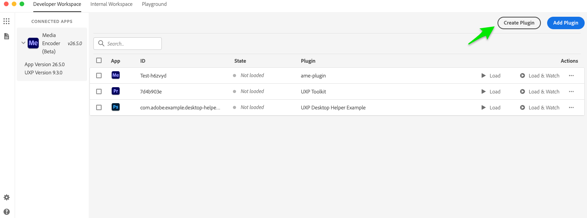
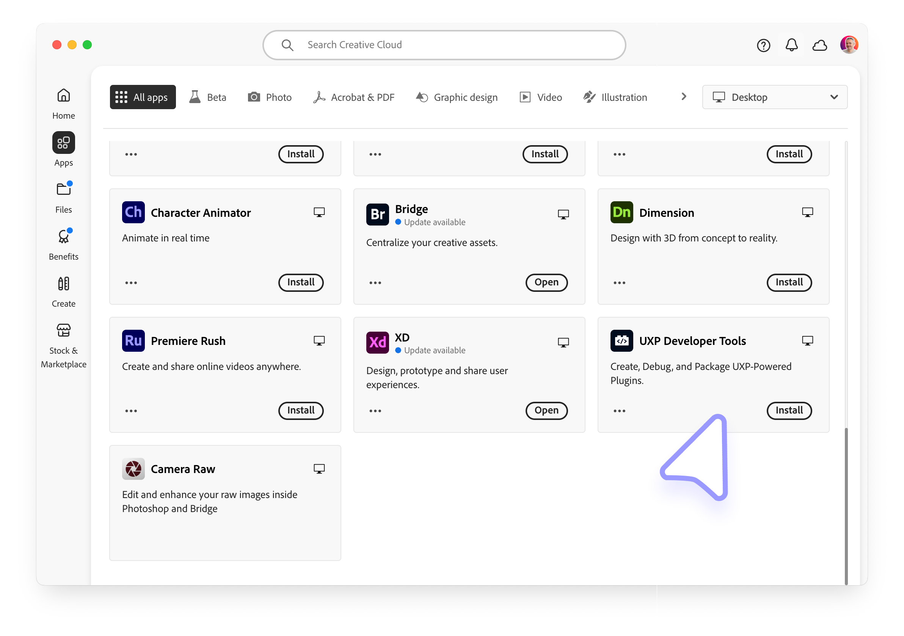
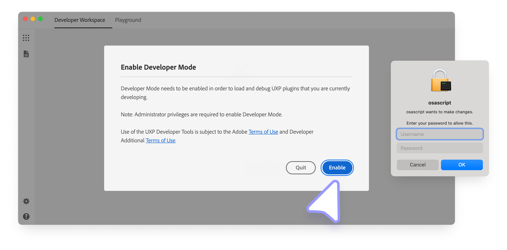

# Developer Tools

Building a UXP plugin takes two tools: a code editor to write it, and the UXP Developer Tool (UDT) to load it into Media Encoder, reload it as you make changes, and debug it. Let's get both installed.

If you've built UXP plugins for Photoshop or Premiere Pro before, none of this is new. The same tools work here, so you can head straight to [building your first plugin](../../plugins/index.md).

## Choose a code editor

A code editor is where you write your plugin's HTML, CSS, and JavaScript. Any modern editor works. Two popular choices:

| Editor | Why pick it |
| --- | --- |
| [Visual Studio Code](https://code.visualstudio.com) | Free, huge extension ecosystem, built-in formatting and linting, and a good fit with UXP workflows. A safe default. |
| [Cursor](https://www.cursor.com/) | Same VS Code foundation with AI-assisted editing built in. |

If you are unsure, start with Visual Studio Code. You can always switch later.

## Install the UXP Developer Tool (UDT)

UDT is the desktop app that connects your code to Media Encoder. It creates plugins, loads them into the host app, reloads them as you edit, and opens a debugger.



UDT also gives you:

- A **Code Playground** to test and explore APIs without a full plugin.
- One-click **packaging** into a `.ccx` installable file, ready to share.
- **Starter templates** and sample projects, so you never begin from an empty folder.

<InlineAlert variant="info" slots="heading,text"/>

Admin privileges are required

UDT needs administrator-level privileges to run correctly. If you cannot get elevated permissions on your machine, you may not be able to use it.

Install UDT directly [from Creative Cloud](https://www.adobe.com/download/uxp-developer-tools), or follow these steps:

1. Open the Adobe Creative Cloud desktop app. If you don't have it, [download and install it first](https://www.adobe.com/download/creative-cloud).
2. Sign in with your Adobe ID.
3. Go to the **All apps** section and search for "UXP Developer Tools".
4. Click **Install** on the UXP Developer Tools card.

   

UDT is not yet available as a Package in the Adobe **Admin Console** for Team and Enterprise customers.

## Enable Developer Mode

The first time you open UDT, it asks you to enable Developer Mode. This is what lets you load in-development plugins into Media Encoder. Click **Enable**, then approve the permission prompt (you may need to enter your password).



If that step fails, turn on Developer Mode by hand. You still need administrative rights.

1. Quit the UXP Developer Tool.
2. Go to `/Library/Application Support/Adobe/UXP/Developer` on macOS, or `%CommonProgramFiles%/Adobe/UXP/Developer` on Windows. Create the folder if it isn't there.
3. Create a file named `settings.json` with this content, then save it:

   ```json
   \{ "developer": true }
   ```

4. Open the UXP Developer Tool again.

## Next step

Your tools are ready. Now [build your first plugin](../../plugins/index.md) and load it into Media Encoder.
