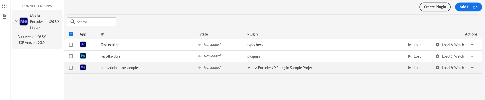
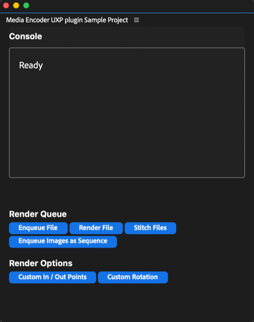

# Render Queue Panel

A UXP reference panel for Adobe Media Encoder that exercises a broad set of Media Encoder UXP APIs: adding media to the render queue, updating render settings, and starting, pausing, and stopping renders. Use it to see how each API behaves before you write your own plugin. The panel lives in the [uxp-media-encoder-plugin-samples](https://github.com/AdobeDocs/uxp-media-encoder-plugin-samples) repository on GitHub.

<InlineAlert variant="info" slots="text"/>

New to UXP plugins? Start with [Build your first plugin](../../build-your-first-plugin/index.md) first. It walks through scaffolding a plugin with the UXP Developer Tool and loading it into Media Encoder, which makes these samples easier to follow.

## Prerequisites

| Tool | Version | Where to get it |
| :--- | :--- | :--- |
| Media Encoder (stable or beta) | 26.5 or newer | [adobe.com/products/media-encoder](https://www.adobe.com/products/media-encoder.html) |
| UXP Developer Tool (UDT) | 2.2.1.18 or newer | [Creative Cloud Desktop](https://creativecloud.adobe.com/apps/download/uxp-developer-tools) |
| Node.js | LTS (18.x or newer) | [nodejs.org](https://nodejs.org/) |
| Code editor | any | Visual Studio Code, Cursor, or your editor of choice |

Before loading any plugin from UDT, enable Developer Mode in Media Encoder: go to **Edit > Preferences > Plugins > Enable developer mode**, then restart Media Encoder. See [Set Up Media Encoder](../../developer-tools/index.md) for the host-specific steps, or [Set Up Developer Tools](https://developer-stage.adobe.com/uxp/guides/how-to/developer-tools/?aio_external) for the shared UDT setup.

## About this sample

In the repository this panel is the `media-encoder-api` sample. It is written in TypeScript, so it requires a build step, and it targets Media Encoder `26.5.0` or newer (manifest v5). These values are sourced from the sample's `manifest.json` and `package.json`, which are authoritative.

## 1. Clone the repository

```bash
git clone https://github.com/AdobeDocs/uxp-media-encoder-plugin-samples.git
cd uxp-media-encoder-plugin-samples
```

## 2. Build the sample

The `media-encoder-api` sample is written in TypeScript, so it has a build step:

```bash
cd sample-panels/media-encoder-api/html
npm install
npm run build
```

`npm run build` deletes the old `build-html/` folder, copies the source from `html/` into `build-html/`, compiles the TypeScript, and runs a small post-build fix.

<InlineAlert variant="warning" slots="text"/>

`build-html/` is what UDT loads, not `html/`. Point UDT at `sample-panels/media-encoder-api/build-html/manifest.json`. If you edit files in `html/` but forget to rebuild, your changes will not show up. This is the most common first-run mistake.

Other useful commands:

```bash
npm run lint    # run ESLint before committing
npm run clean   # delete build-html/
npm run copy    # copy source to build-html/ without compiling (for HTML-only edits)
```

## 3. Load the plugin in Media Encoder

The loading flow is the same for every sample:

1. Launch Media Encoder (or Media Encoder Beta).
2. Launch the UXP Developer Tool.
3. Click **Add Plugin** and select the sample's `manifest.json` (for `media-encoder-api`, the one in `build-html/`).
4. Click **Load**, or **Load & Watch** to enable automatic reloads while editing source files.



The panel then appears in Media Encoder under **Window > UXP Plugins**.



## How the media-encoder-api sample works

Click a button in the panel to run an API call, then find the code behind it in `html/src/`. The panel also has a built-in console area at the top of the UI that logs the result of each button click, so you do not always need DevTools open.

Each file in `src/` covers one part of the API:

| File | What it covers |
| :--- | :--- |
| `render-queue.ts` | Manage the Render Queue |
| `utils.ts` | Shared logging helper used across all modules |

Because the sample is TypeScript, UDT's **Watch** mode will not auto-reload your changes. The development loop is:

1. Edit files in `html/src/` or `html/index.html`.
2. Run `npm run build`.
3. Click **Reload** in UDT.

If you only changed `index.html` and no `.ts` files, `npm run copy` plus a reload is faster than a full build. Changes to `manifest.json` always need an **Unload** followed by a **Load** in UDT, not just a reload.

## Debugging

Click **Debug** in UDT next to the loaded plugin to open a Chromium DevTools window connected to your panel, with the console, network tab, sources, and DOM inspector. The panel's built-in console area also logs each button's result directly in the UI.

For breakpoints, watch expressions, error handling, and other shared techniques, see [Debug Your Plugin](https://developer-stage.adobe.com/uxp/guides/how-to/debugging/?aio_external) in the UXP Hub.

## Troubleshooting

**My plugin does not appear in Media Encoder.**

Confirm that Developer Mode is enabled and that Media Encoder was restarted afterward, that the manifest's `host.minVersion` is less than or equal to your installed Media Encoder version, and that UDT detects Media Encoder in its left pane.

**Do Media Encoder UXP API calls need to be awaited?**

Yes. Most APIs return Promises and must be awaited (or chained with `.then()`). The `media-encoder-api` sample uses `async`/`await` consistently and is a good reference for the pattern.

**How do I request file system or network access?**

Declare the capabilities under `requiredPermissions` in your `manifest.json`. The `media-encoder-api` manifest demonstrates `localFileSystem` and `clipboard` permissions.

**My changes to `manifest.json` are not showing up.**

UDT's Watch mode only reloads source files. After editing `manifest.json`, do an Unload followed by a Load in UDT, not just a Reload.

## Related

- [Media Encoder API reference](../../../media-encoder-api/index.md)
- [Build your first plugin](../../build-your-first-plugin/index.md)
- [TypeScript setup](https://developer-stage.adobe.com/uxp/guides/how-to/typescript/?aio_external)
- [UXP API reference](https://developer-stage.adobe.com/uxp/uxp-api/?aio_external)
- [uxp-media-encoder-plugin-samples on GitHub](https://github.com/AdobeDocs/uxp-media-encoder-plugin-samples)