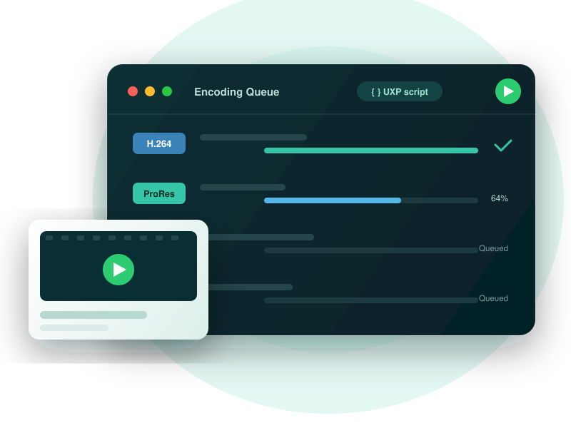

<Superhero variant="halfWidth" textColor="white" slots="heading, text, image" background="rgb(64, 34, 138)"/>

# Automate Adobe Media Encoder with UXP

Build plugins that run inside Media Encoder, discover presets, and drive the encoding queue. Turn repetitive exports into one-click workflows with HTML, CSS, and JavaScript.

<InlineAlert variant="info" slots="text"/>

UXP for Adobe Media Encoder is in public beta. APIs and supported capabilities may change before general availability.

## Choose Where to Start

UXP has two layers: a shared platform for building plugins across Adobe applications, and a host API for working with Media Encoder. Start with the path that matches what you need.

<Cards slots="image, heading, text, links" repeat="2" width="100%" />

### New to UXP?

Set up your tools, learn plugin concepts and workflows, use shared APIs and recipes, debug your code, migrate existing extensions, and package and publish plugins.

[Start in the UXP Hub](https://developer-stage.adobe.com/uxp/?aio_external)

### Building for Media Encoder?

Check the host requirements, enable Developer Mode, and build a plugin that runs inside Media Encoder.

[Get Started](get-started/index.md)

## Build for Media Encoder

This site covers the parts of UXP development that are specific to Media Encoder.

<DiscoverBlock slots="link, text"/>

[Get Started](get-started/index.md)

Prepare Media Encoder for development and connect it to the UXP Developer Tool.

<DiscoverBlock slots="link, text"/>

[Build Your First Plugin](get-started/build-your-first-plugin/index.md)

Scaffold, load, edit, and reload a Media Encoder panel using the `ame-quick-starter` template.

<DiscoverBlock slots="link, text"/>

[Explore the Render Queue Panel](get-started/samples/render-queue-panel/index.md)

Build and inspect a TypeScript sample that exercises the render queue, render options, and job APIs.

## Choose the Right API

Most plugins use both API layers. Use the shared UXP APIs for platform capabilities, then use the Media Encoder API to work with encoding features.

<DiscoverBlock slots="link, text"/>

[UXP API Reference](https://developer-stage.adobe.com/uxp/uxp-api/?aio_external)

File system, networking, storage, HTML, CSS, and Spectrum UI capabilities shared by every UXP host.

<DiscoverBlock slots="link, text"/>

[Media Encoder API Reference](media-encoder-api/index.md)

The render queue, presets, jobs, progress reporting, watch folders, and other Media Encoder automation surfaces.

## Continue in the UXP Hub

When your Media Encoder integration is working, continue with the shared developer journey:

- [Learn UXP concepts and workflows](https://developer-stage.adobe.com/uxp/guides/?aio_external)
- [Package and distribute your plugin](https://developer-stage.adobe.com/uxp/guides/how-to/distribution/overview/?aio_external)
- [Migrate from CEP or ExtendScript](https://developer-stage.adobe.com/uxp/migration-center/?aio_external)
- [Ask questions in the Creative Cloud Developer Forums](https://forums.creativeclouddeveloper.com/)
