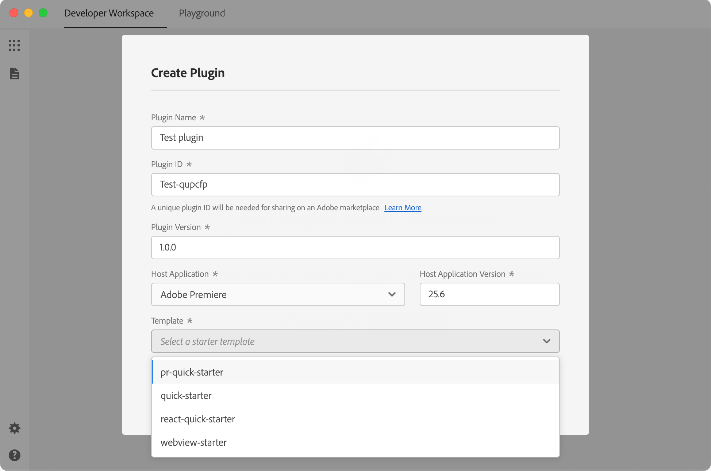

# Starters and samples

Learn from working examples and jumpstart your plugin development with sample code and starter templates.

## Overview

When building UXP plugins for Media Encoder, you don't need to start from scratch. We provide two types of resources to help you:

- **Samples**: Complete, working examples that demonstrate specific features or use cases
- **Starters**: Minimal templates with framework setup to help you begin a new plugin project

## GitHub repository

<InlineAlert variant="info" slots="heading, text" />

Placeholder — repository pending

A public samples repository is planned but not yet published. The link and contents below are illustrative and will be confirmed by the product team before this page goes live.

[UXP Media Encoder Samples](https://github.com/AdobeDocs/uxp-media-encoder-samples)

This repository is expected to include:

- Working plugin examples for common tasks
- Best practices for plugin architecture
- Integration examples with Media Encoder APIs
- Reusable code patterns you can adapt for your projects

## UDT templates

When you create a new plugin with the UXP Developer Tool (UDT), you can choose from several built-in templates:

These templates provide a ready-to-use project structure with:

- Pre-configured `manifest.json` file
- Basic HTML and JavaScript scaffolding
- Example code demonstrating key concepts
- Proper directory organization

To use a template, select it when running the `create` command in UDT. Learn more about this process in the [UDT Deep Dive tutorial](../../plugins/index.md).

## Hybrid Plugin SDK

<InlineAlert variant="info" slots="heading, text" />

Placeholder — availability to be confirmed

Whether Hybrid Plugins (JavaScript combined with native C++ code) are supported for Media Encoder, and where the SDK can be downloaded, is still to be confirmed with the product team. The description below is illustrative.

If you're building a [Hybrid Plugin](../../plugins/index.md) that combines JavaScript with native C++ code, download the **UXP Hybrid Plugin SDK** from the [Adobe Developer Console](https://developer.adobe.com/console). The SDK is expected to include:

- C++ headers and API definitions for building native addons (`.uxpaddon` files)
- A `template-dev` project with source code to use as a starting point
- A pre-compiled `template-plugin` you can load directly into UDT

See the [Hybrid Plugins guide](../../plugins/index.md) for build instructions and configuration details.

## Tutorials

Looking to build something from scratch? The [Plugins guide](../../plugins/index.md) walks you through complete plugin development tasks, from setting up the UXP Developer Tool to creating commands, panels, modal dialogs, and inter-plugin communication in Media Encoder.

## Recipes

For quick, focused code examples without the full tutorial treatment, check out the [Recipes section](../recipes/index.md). Recipes provide bite-sized, ready-to-use code snippets for common use cases:

- File system operations
- Network requests
- UI interactions
- Clipboard access
- And more

## Contributing

We'd love to expand this collection with more real-world examples. If you've built something useful, consider contributing:

1. Fork the [samples repository](https://github.com/AdobeDocs/uxp-media-encoder-samples)
2. Add your sample with clear documentation
3. Create a pull request and tag us for review

Your contributions help the entire plugin developer community!
